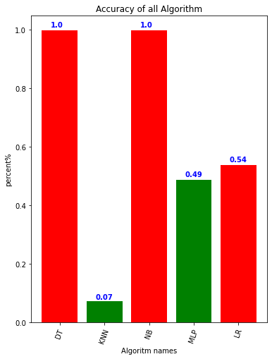
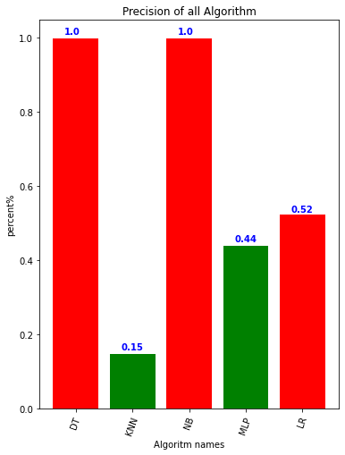
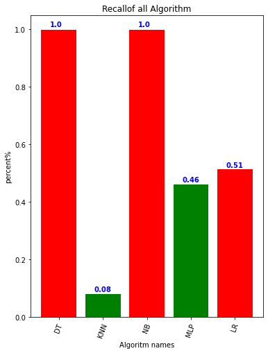
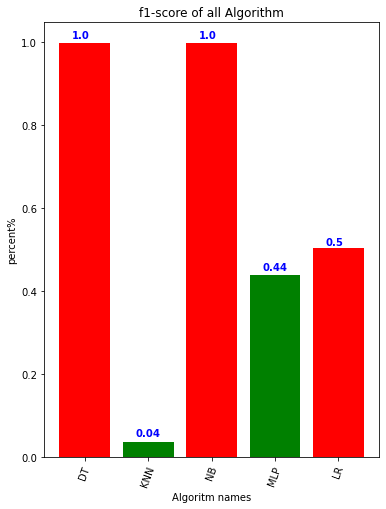
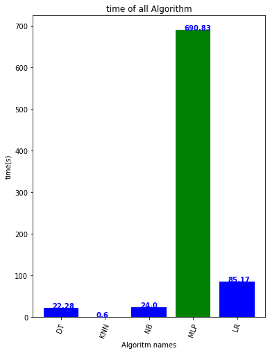

```python
# Author : Amir Shokri
# github link : https://github.com/amirshnll/Vicon-Physical-Action
# dataset link : http://archive.ics.uci.edu/ml/datasets/Vicon+Physical+Action+Data+Set
# email : amirsh.nll@gmail.com
```

# Read data


```python
import pandas as pd
import numpy as np
import os

path_data='data'
lbl_binary=list()
lbl_20_class=list()
data=[]
for folder in os.listdir(path_data):
    path_in=os.path.join(path_data,folder)
    for sub_folder in os.listdir(path_in):
        
        print('---------{0}------------'.format(sub_folder))
        path_in2=os.path.join(path_in,sub_folder)
        for file_name in os.listdir(path_in2):
            lbl_one=file_name[:-4]
            print(file_name[:-4])
            path_file=os.path.join(path_in2,file_name)
            txt_data=np.array(pd.read_csv(path_file, delim_whitespace=True))
            txt_data=txt_data[:,1:]
            data.extend(txt_data)
            lbl_all=((lbl_one+',')*txt_data.shape[0]).split(',')[:-1]
            lbl_20_class.extend(lbl_all)
            print(txt_data.shape)
```

    ---------aggressive------------
    Elbowing
    (2396, 27)
    Frontkicking
    (2091, 27)
    Hamering
    (1901, 27)
    Headering
    (1510, 27)
    Kneeing
    (2460, 27)
    Pulling
    (1872, 27)
    Punching
    (2485, 27)
    Pushing
    (2095, 27)
    Sidekicking
    (1444, 27)
    Slapping
    (2136, 27)
    ---------normal------------
    Bowing
    (2013, 27)
    Clapping
    (1715, 27)
    Handshaking
    (2558, 27)
    Hugging
    (1972, 27)
    Jumping
    (1906, 27)
    Running
    (2241, 27)
    Seating
    (2273, 27)
    Standing
    (2101, 27)
    Walking
    (1720, 27)
    Waving
    (971, 27)
    ---------aggressive------------
    Elbowing
    (2093, 27)
    Frontkicking
    (2133, 27)
    Hamering
    (1933, 27)
    Headering
    (1956, 27)
    Kneeing
    (2471, 27)
    Pulling
    (1788, 27)
    Punching
    (1858, 27)
    Pushing
    (1639, 27)
    Sidekicking
    (2425, 27)
    Slapping
    (2462, 27)
    ---------normal------------
    Bowing
    (1943, 27)
    Clapping
    (1822, 27)
    Handshaking
    (1591, 27)
    Hugging
    (2019, 27)
    Jumping
    (2030, 27)
    Running  [worse]
    (2093, 27)
    Running
    (2338, 27)
    Seating
    (2096, 27)
    Standing
    (2463, 27)
    Walking
    (1555, 27)
    ---------aggressive------------
    Elbowing
    (2012, 27)
    Frontkicking
    (1675, 27)
    Hamering
    (1465, 27)
    Headering
    (2473, 27)
    Kneeing
    (1892, 27)
    Pulling
    (2348, 27)
    Punching
    (2099, 27)
    Pushing
    (1483, 27)
    Sidekicking
    (2271, 27)
    Slapping
    (1714, 27)
    ---------normal------------
    Bowing
    (1842, 27)
    Clapping
    (1983, 27)
    Handshaking
    (1829, 27)
    Hugging
    (2010, 27)
    Jumping
    (1099, 27)
    Running
    (2287, 27)
    Seating
    (2325, 27)
    Standing
    (2352, 27)
    Walking
    (1685, 27)
    Waving
    (1963, 27)
    ---------aggressive------------
    Elbowing
    (3532, 27)
    Frontkicking
    (3314, 27)
    Hamering
    (3926, 27)
    Headering
    (3832, 27)
    Kneeing
    (3513, 27)
    Pulling
    (3622, 27)
    Punching
    (3557, 27)
    Pushing
    (3126, 27)
    Sidekicking
    (2335, 27)
    Slapping
    (3522, 27)
    ---------normal------------
    Bowing
    (3673, 27)
    Clapping
    (3609, 27)
    Handshaking
    (3029, 27)
    Hugging
    (3307, 27)
    Jumping
    (2957, 27)
    Running
    (1534, 27)
    Seating
    (3021, 27)
    Standing
    (3162, 27)
    Walking
    (2005, 27)
    Waving
    (2769, 27)
    ---------aggressive------------
    Elbowing
    (2804, 27)
    Frontkicking
    (3324, 27)
    Hamering
    (3574, 27)
    Headering
    (4013, 27)
    Kneeing
    (2977, 27)
    Pulling
    (4235, 27)
    Punching
    (3419, 27)
    Pushing
    (3413, 27)
    Sidekicking
    (4193, 27)
    Slapping
    (4223, 27)
    ---------normal------------
    Bowing
    (3751, 27)
    Clapping
    (3045, 27)
    Handshaking
    (3078, 27)
    Hugging
    (4103, 27)
    Jumping
    (2946, 27)
    Running
    (3032, 27)
    Seating
    (3763, 27)
    Standing
    (4106, 27)
    Walking
    (3087, 27)
    Waving
    (6416, 27)
    ---------aggressive------------
    Elbowing
    (4119, 27)
    Frontkicking
    (4146, 27)
    Hamering
    (6242, 27)
    Headering
    (3706, 27)
    Kneeing
    (5516, 27)
    Pulling
    (6399, 27)
    Punching
    (4232, 27)
    Pushing
    (4260, 27)
    Sidekicking
    (4174, 27)
    Slapping
    (6519, 27)
    ---------normal------------
    Bowing
    (4272, 27)
    Clapping
    (3952, 27)
    Handshaking
    (4197, 27)
    Hugging
    (4335, 27)
    Jumping
    (4054, 27)
    Running
    (4269, 27)
    Seating
    (4244, 27)
    Standing
    (3838, 27)
    Walking
    (6373, 27)
    Waving
    (4305, 27)
    ---------aggressive------------
    Elbowing
    (3649, 27)
    Frontkicking
    (4365, 27)
    Hamering
    (4138, 27)
    Headering
    (3695, 27)
    Kneeing
    (5972, 27)
    Pulling
    (3595, 27)
    Punching
    (4757, 27)
    Pushing
    (2831, 27)
    Sidekicking
    (3689, 27)
    Slapping
    (6255, 27)
    ---------normal------------
    Bowing
    (4155, 27)
    Clapping
    (4733, 27)
    Handshaking
    (4179, 27)
    Hugging
    (4763, 27)
    Jumping
    (4142, 27)
    Running
    (4154, 27)
    Seating
    (6273, 27)
    Standing
    (4215, 27)
    Walking
    (5949, 27)
    Waving
    (4035, 27)
    ---------aggressive------------
    Elbowing
    (1691, 27)
    Frontkicking
    (1925, 27)
    Hamering
    (1893, 27)
    Headering
    (1885, 27)
    Kneeing
    (1793, 27)
    Pulling
    (1988, 27)
    Punching
    (2167, 27)
    Pushing
    (1508, 27)
    Sidekicking
    (1986, 27)
    Slapping
    (1954, 27)
    ---------normal------------
    Bowing
    (1944, 27)
    Clapping
    (2066, 27)
    Handshaking
    (1778, 27)
    Hugging
    (1624, 27)
    Jumping
    (2285, 27)
    Running
    (1059, 27)
    Seating
    (1888, 27)
    Standing
    (1999, 27)
    Walking
    (1645, 27)
    Waving
    (2193, 27)
    ---------aggressive------------
    Elbowing
    (4477, 27)
    Frontkicking
    (4122, 27)
    Hamering
    (6362, 27)
    Headering
    (6541, 27)
    Kneeing
    (3182, 27)
    Pulling
    (4484, 27)
    Punching
    (4380, 27)
    Pushing
    (4288, 27)
    Sidekicking
    (4201, 27)
    Slapping
    (4293, 27)
    ---------normal------------
    Bowing
    (4505, 27)
    Clapping
    (4441, 27)
    Handshaking
    (4433, 27)
    Hugging
    (6607, 27)
    Jumping
    (4215, 27)
    Running
    (4299, 27)
    Seating
    (6779, 27)
    Standing
    (3806, 27)
    Walking
    (4426, 27)
    Waving
    (4048, 27)
    ---------aggressive------------
    Elbowing
    (1510, 27)
    Frontkicking
    (1474, 27)
    Hamering
    (782, 27)
    Headering
    (2115, 27)
    Kneeing
    (1622, 27)
    Pulling
    (1142, 27)
    Punching
    (1807, 27)
    Pushing
    (1681, 27)
    Sidekicking
    (792, 27)
    Slapping
    (2155, 27)
    ---------normal------------
    Bowing
    (1590, 27)
    Clapping
    (1928, 27)
    Handshaking
    (2000, 27)
    Hugging
    (2189, 27)
    Jumping
    (1671, 27)
    Running
    (1632, 27)
    Seating
    (2337, 27)
    Standing
    (2176, 27)
    Walking
    (2302, 27)
    Waving
    (2198, 27)
    


```python
print(len(lbl_20_class))
print(len(data))
```

    605181
    605181
    

# Preproccessing


```python
print('-----------Preproccessing----------------')

from sklearn.preprocessing import LabelEncoder
import numpy as np
encoder = LabelEncoder()
lbl_20_class=np.array(lbl_20_class)
lbl_20_class=encoder.fit_transform(lbl_20_class.reshape(-1, 1))


print(lbl_20_class)
```

    -----------Preproccessing----------------
    

    C:\Users\Human\anaconda3\lib\site-packages\sklearn\utils\validation.py:73: DataConversionWarning: A column-vector y was passed when a 1d array was expected. Please change the shape of y to (n_samples, ), for example using ravel().
      return f(**kwargs)
    

    [ 2  2  2 ... 20 20 20]
    

# normalize


```python
from sklearn import preprocessing
Data_lable=lbl_20_class
Data_main=data
from sklearn.preprocessing import MinMaxScaler
scaler = MinMaxScaler()
scaler.fit(Data_main)
Data_main=scaler.transform(Data_main)
print(Data_main)
```

    [[0.68426919 0.55894291 0.70059154 ... 0.6955238  0.51383589 0.10203499]
     [0.68426919 0.55894291 0.70059154 ... 0.6955238  0.51383589 0.10203499]
     [0.68426919 0.55894291 0.70059154 ... 0.6955238  0.51383589 0.10203499]
     ...
     [0.4956291  0.48598417 0.73733102 ... 0.52708659 0.57787027 0.09402593]
     [0.4956291  0.48598417 0.73733102 ... 0.52708659 0.57787027 0.09402593]
     [0.4956291  0.48598417 0.73733102 ... 0.52708659 0.57787027 0.09402593]]
    

# 'DT','KNN','NB','MLP','LR'


```python
import numpy as np
import os
from pytictoc import TicToc
import matplotlib.pyplot as plt
from sklearn.metrics import classification_report, confusion_matrix
from sklearn.metrics import accuracy_score
from sklearn.neighbors import KNeighborsClassifier
from sklearn.tree import DecisionTreeClassifier
from sklearn.naive_bayes import BernoulliNB,MultinomialNB
from sklearn.linear_model import LogisticRegression
from sklearn.neural_network import MLPClassifier


def run_all_algorithm(Train_data,Test_data,Train_lable,Test_lable,str_out):
    
        
    print(np.shape(Test_data))
    print(np.shape(Train_data))
    print(np.shape(Train_lable))
    print(np.shape(Test_lable))
    
    algorithms_name=['DT','KNN','NB','MLP','LR']
    alg_num=len(algorithms_name)
    accuracy_array=np.zeros(alg_num)
    precision_array=np.zeros(alg_num)
    recall_array=np.zeros(alg_num)
    f1_score_array=np.zeros(alg_num)
    time_array=np.zeros(alg_num)

    t = TicToc()
          

    print('---------------------DT---------------------')
    K=0;
    t.tic() #Start timer
    classifier_DT = DecisionTreeClassifier(max_depth=1000,random_state=0)
    classifier_DT.fit(Train_data, Train_lable)
    Test_predict = classifier_DT.predict(Test_data)
    Con_matrix=confusion_matrix(Test_lable, Test_predict)
    TimeDT=t.tocvalue() #Time elapsed since t.tic()
    classfi_report=classification_report(Test_lable, Test_predict,output_dict=True)
    
    # save to array
    accuracy_array[K]=accuracy_score(Test_lable, Test_predict)
    precision_array[K]= classfi_report['macro avg']['precision'] 
    recall_array[K]= classfi_report['macro avg']['recall']    
    f1_score_array[K]= classfi_report['macro avg']['f1-score']
    time_array[K]=TimeDT
    print(accuracy_array[K])
    
    
    print('--------------NB----------------')
    K+=1;
    t.tic() #Start timer
    classifier = MultinomialNB()
    classifier.fit(Train_data, Train_lable)
    Test_predict = classifier.predict(Test_data)
    TimeNB=t.tocvalue() #Time elapsed since t.tic()
    Con_matrix=confusion_matrix(Test_lable, Test_predict)
    classfi_report=classification_report(Test_lable, Test_predict,output_dict=True)
    
    
    # save to array
    accuracy_array[K]=accuracy_score(Test_lable, Test_predict)
    precision_array[K]= classfi_report['macro avg']['precision'] 
    recall_array[K]= classfi_report['macro avg']['recall']    
    f1_score_array[K]= classfi_report['macro avg']['f1-score']
    time_array[K]=TimeNB
    print(accuracy_array[K])
    print('---------------------KNN---------------------')
    K+=1;
    t.tic() #Start timer
    classifier=KNeighborsClassifier(n_neighbors=10)
    classifier.fit(Train_data, Train_lable)
    Test_predict = classifier.predict(Test_data)
    TimeKNN=t.tocvalue() #Time elapsed since t.tic()
    Con_matrix=confusion_matrix(Test_lable, Test_predict)
    classfi_report=classification_report(Test_lable, Test_predict,output_dict=True)
    
    # save to array
    accuracy_array[K]=accuracy_score(Test_lable, Test_predict)
    precision_array[K]= classfi_report['macro avg']['precision'] 
    recall_array[K]= classfi_report['macro avg']['recall']    
    f1_score_array[K]= classfi_report['macro avg']['f1-score']
    time_array[K]=TimeKNN
    print(accuracy_array[K])
    
    print('---------------------MLP---------------------')
    K+=1;
    t.tic() #Start timer
    classifier=MLPClassifier( solver='adam', random_state=0,hidden_layer_sizes=[5], max_iter=200)
    classifier.fit(Train_data, Train_lable)
    Test_predict = classifier.predict(Test_data)
    TimeMLP=t.tocvalue() #Time elapsed since t.tic()
    Con_matrix=confusion_matrix(Test_lable, Test_predict)
    classfi_report=classification_report(Test_lable, Test_predict,output_dict=True)
    
    # save to array
    accuracy_array[K]=accuracy_score(Test_lable, Test_predict)
    precision_array[K]= classfi_report['macro avg']['precision'] 
    recall_array[K]= classfi_report['macro avg']['recall']    
    f1_score_array[K]= classfi_report['macro avg']['f1-score']
    time_array[K]=TimeMLP
    print(accuracy_array[K])
    
    print('---------------------LogisticRegression---------------------')
    K+=1;
    t.tic() #Start timer
    classifier=LogisticRegression()
    classifier.fit(Train_data, Train_lable)
    Test_predict = classifier.predict(Test_data)
    TimeLR=t.tocvalue() #Time elapsed since t.tic()
    Con_matrix=confusion_matrix(Test_lable, Test_predict)
    classfi_report=classification_report(Test_lable, Test_predict,output_dict=True)
    
    # save to array
    accuracy_array[K]=accuracy_score(Test_lable, Test_predict)
    precision_array[K]= classfi_report['macro avg']['precision'] 
    recall_array[K]= classfi_report['macro avg']['recall']    
    f1_score_array[K]= classfi_report['macro avg']['f1-score']
    time_array[K]=TimeLR
    print(accuracy_array[K])
    
    
    
    
    

    H=6
    L=8
    
    
    
    print('--------------------result--------------------------')
    fig1=plt.figure(figsize=(H, L)) #  
    plt.bar(algorithms_name, accuracy_array,color = ['red', 'green'])
    plt.xticks(algorithms_name, rotation=70)
    plt.ylabel('percent%')
    plt.title('Accuracy of all Algorithm')
    plt.xlabel("Algoritm names")
    for i, v in enumerate(accuracy_array):
        v=round(v,2)
        plt.text(i-0.2 , v+0.01 , str(v), color='blue', fontweight='bold')
    fig1.show()
    plt.savefig(os.path.join(str_out+' accuracy.png'), dpi=300, format='png', bbox_inches='tight') # use format='svg' or 'pdf' for vectorial pictures
    
     
    fig2=plt.figure(figsize=(H, L)) #  
    plt.bar(algorithms_name, precision_array,color = ['red', 'green'])
    plt.xticks(algorithms_name, rotation=70)
    plt.ylabel('percent%')
    plt.title('Precision of all Algorithm')
    plt.xlabel("Algoritm names")
    for i, v in enumerate(precision_array):
        v=round(v,2)
        plt.text(i-0.2 , v+0.01 , str(v), color='blue', fontweight='bold')
    fig2.show()
    plt.savefig(os.path.join(str_out+' precision.png'), dpi=300, format='png', bbox_inches='tight') # use format='svg' or 'pdf' for vectorial pictures
    
    
    
    
    fig3=plt.figure(figsize=(H, L)) #  
    plt.bar(algorithms_name, recall_array,color = ['red', 'green'])
    plt.xticks(algorithms_name, rotation=70)
    plt.ylabel('percent%')
    plt.title('Recallof all Algorithm')
    plt.xlabel("Algoritm names")
    for i, v in enumerate(recall_array):
        v=round(v,2)
        plt.text(i-0.2 , v+0.01 , str(v), color='blue', fontweight='bold')
    fig3.show()
    plt.savefig(os.path.join(str_out+' recall.png'), dpi=300, format='png', bbox_inches='tight') # use format='svg' or 'pdf' for vectorial pictures
    
    
    
    fig4=plt.figure(figsize=(H, L)) #  
    plt.bar(algorithms_name, f1_score_array,color = ['red', 'green'])
    plt.xticks(algorithms_name, rotation=70)
    plt.ylabel('percent%')
    plt.title('f1-score of all Algorithm')
    plt.xlabel("Algoritm names")
    for i, v in enumerate(f1_score_array):
        v=round(v,2)
        plt.text(i-0.2 , v+0.01 , str(v), color='blue', fontweight='bold')
    fig4.show()
    plt.savefig(os.path.join(str_out+' f1_score.png'), dpi=300, format='png', bbox_inches='tight') # use format='svg' or 'pdf' for vectorial pictures
    
    
    
    fig5=plt.figure(figsize=(H, L)) # 
    plt.bar(algorithms_name, time_array,color = ['blue', 'green'])
    plt.xticks(algorithms_name, rotation=70)
    plt.ylabel('time(s)')
    plt.title('time of all Algorithm')
    plt.xlabel("Algoritm names")
    for i, v in enumerate(time_array):
        v=round(v,2)
        plt.text(i-0.2 , v+0.01 , str(v), color='blue', fontweight='bold')
    plt.savefig(os.path.join(str_out+' time.png'), dpi=300, format='png', bbox_inches='tight') # use format='svg' or 'pdf' for vectorial pictures
    fig5.show()
    
    
    np.savetxt(str_out+'accuracy.csv', accuracy_array, delimiter=',')
    np.savetxt(str_out+' precision_array.csv', precision_array, delimiter=',')
    np.savetxt(str_out+'recall_array.csv', recall_array, delimiter=',')
    np.savetxt(str_out+' time_array.csv', time_array, delimiter=',')
    np.savetxt(str_out+' f1-score.csv', f1_score_array, delimiter=',')

```

# train_test_split


```python
from sklearn.model_selection import train_test_split
Train_data, Test_data, Train_lable, Test_lable = train_test_split(Data_main, Data_lable, test_size=0.20)
run_all_algorithm(Train_data, Test_data, Train_lable, Test_lable ,"")
```

    (121037, 27)
    (484144, 27)
    (484144,)
    (121037,)
    ---------------------DT---------------------
    0.9986119946793129
    --------------NB----------------
    

    C:\Users\Human\anaconda3\lib\site-packages\sklearn\metrics\_classification.py:1221: UndefinedMetricWarning: Precision and F-score are ill-defined and being set to 0.0 in labels with no predicted samples. Use `zero_division` parameter to control this behavior.
      _warn_prf(average, modifier, msg_start, len(result))
    

    0.07363037748787561
    ---------------------KNN---------------------
    0.998562423060717
    ---------------------MLP---------------------
    

    C:\Users\Human\anaconda3\lib\site-packages\sklearn\neural_network\_multilayer_perceptron.py:582: ConvergenceWarning: Stochastic Optimizer: Maximum iterations (200) reached and the optimization hasn't converged yet.
      warnings.warn(
    C:\Users\Human\anaconda3\lib\site-packages\sklearn\metrics\_classification.py:1221: UndefinedMetricWarning: Precision and F-score are ill-defined and being set to 0.0 in labels with no predicted samples. Use `zero_division` parameter to control this behavior.
      _warn_prf(average, modifier, msg_start, len(result))
    

    0.48655369845584406
    ---------------------LogisticRegression---------------------
    

    C:\Users\Human\anaconda3\lib\site-packages\sklearn\linear_model\_logistic.py:762: ConvergenceWarning: lbfgs failed to converge (status=1):
    STOP: TOTAL NO. of ITERATIONS REACHED LIMIT.
    
    Increase the number of iterations (max_iter) or scale the data as shown in:
        https://scikit-learn.org/stable/modules/preprocessing.html
    Please also refer to the documentation for alternative solver options:
        https://scikit-learn.org/stable/modules/linear_model.html#logistic-regression
      n_iter_i = _check_optimize_result(
    

    0.5379594669398614
    --------------------result--------------------------
    

    <ipython-input-60-a1fc3c3f9089>:144: UserWarning: Matplotlib is currently using module://ipykernel.pylab.backend_inline, which is a non-GUI backend, so cannot show the figure.
      fig1.show()
    <ipython-input-60-a1fc3c3f9089>:157: UserWarning: Matplotlib is currently using module://ipykernel.pylab.backend_inline, which is a non-GUI backend, so cannot show the figure.
      fig2.show()
    <ipython-input-60-a1fc3c3f9089>:172: UserWarning: Matplotlib is currently using module://ipykernel.pylab.backend_inline, which is a non-GUI backend, so cannot show the figure.
      fig3.show()
    <ipython-input-60-a1fc3c3f9089>:186: UserWarning: Matplotlib is currently using module://ipykernel.pylab.backend_inline, which is a non-GUI backend, so cannot show the figure.
      fig4.show()
    <ipython-input-60-a1fc3c3f9089>:201: UserWarning: Matplotlib is currently using module://ipykernel.pylab.backend_inline, which is a non-GUI backend, so cannot show the figure.
      fig5.show()
    

















```python

```
